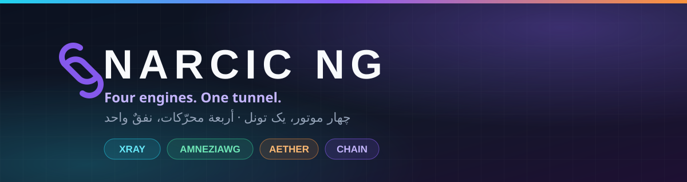

<div align="center">
  
  <br/>
  <a href="#-english"></a>
  <a href="#-فارسی"></a>
  <a href="#-العربية"></a>
</div>

<div align="center">

[](#)
[](#)
[](#)
[](#)
[](#)

</div>

---

<a id="-english"></a>
## 🇬🇧 English

**Narcic NG** (`com.narcic.ng`) is a dark-themed, fully redesigned Android client for censorship circumvention — a heavily modified fork of v2rayNG that runs **four connection engines** side by side behind one camera-style engine switcher.

### ⚡ Why it's different

| | |
|---|---|
| 🔀 **4 engines, 1 switcher** | V2Ray, AmneziaWG, Aether and Narcic Chain — each with its own page, default group and accent color. Switching is locked while a tunnel is up. |
| ⛓️ **Two-engine chains** | Any engine can sit in either slot of a chain: a carrier hop plus an exit hop, assembled into one Xray config (`dialerProxy`) or driven through the core's upstream. |
| 🛰️ **Embedded Psiphon** | A Rust core ships with Psiphon inside — signed bundled server list (verified against Psiphon's public key), egress-region picker for 27 countries, Tor bridges and relays. |
| 🔗 **Self-contained share links** | `narcicchain://` links embed the whole chain — the AmneziaWG config text plus the Psiphon exit region — so one paste builds every profile. |
| 📊 **Live dashboards** | Real-time speed sparkline, traffic stats, delay testing, connection map, per-country IP display. |
| 🧩 **Compose UI** | Jetpack Compose, Material 3, full RTL support, glass-style cards and a dark-first design language. |

### 🔀 The four engines

| Engine | Core | What it does |
|---|---|---|
| **V2Ray** | Xray | VLESS, VMess, Trojan, Shadowsocks, HTTP, Hysteria2 and more, with full routing rules. |
| **AmneziaWG** | amneziawg-go | WireGuard with junk-packet obfuscation; imports raw `.conf` files with `Jc/Jmin/Jmax/S1-4/H1-4/I1-5` intact. |
| **Aether** | Rust + Psiphon + Tor | MASQUE/WARP tunneling with Psiphon or Tor nested inside or around it, WARP key renewal, endpoint scanning. |
| **Narcic Chain** | Xray + Aether + AWG | The two-engine chain engine: e.g. an AmneziaWG carrier into a Psiphon exit in any of **27 countries**, shared as links. |

### 🔗 The `narcicchain://` link format

```
narcicchain://chain?conf=<base64url .conf>&region=DE#🇩🇪 Narcic Chain
narcicchain://direct?conf=<base64url .conf>#🇮🇷 Narcic AMWG
```

- `conf` — the AmneziaWG `[Interface]/[Peer]` config text, base64url-encoded (no padding)
- `region` — the Psiphon egress country; omit it for a plain, unchained config
- Import via **clipboard** or file: one link per line; profiles dedupe by config, region and pair, so re-importing never duplicates anything.

<details>
  <summary><b>Chain topology (click to expand)</b></summary>

```
Traffic:  TUN ──▶ carrier (hop 1) ──▶ exit (hop 2) ──▶ internet
          e.g.      AWG / WARP            Psiphon (country)

Xray-dialable carrier  → exit's first outbound gets sockopt.dialerProxy → "chain1"
Aether exit            → its core dials out through a loopback SOCKS inbound
                         routed to the carrier (AETHER_UPSTREAM), warmed up before
                         the app reports "connected".
```

Members are referenced by profile ID, shared between chains, and can be any engine type in either slot (the one forbidden pair is Aether over Aether).

</details>

### 📥 Install & build

```bash
git clone --recurse-submodules https://github.com/<you>/Narcic_APK.git
cd Narcic_APK/V2rayNG
./gradlew :app:assemblePlaystoreDebug   # or assembleFdroidDebug
```

- **Requirements:** JDK 21, Android SDK 37, NDK for the native cores. The Rust/Go cores build through `compile-aether.sh`, `compile-psiphon.sh`, `compile-pt.sh` at the repo root.
- Bundling a fresh Psiphon server list: `./fetch-psiphon-servers.sh` (signature-verified).

### ⚖️ Disclaimer & license

This project exists to restore open access to the internet where it is restricted. Use it responsibly and in accordance with your local laws. Not affiliated with the upstream projects.

Licensed under **GPL-3.0**. Built on the shoulders of [v2rayNG](https://github.com/2dust/v2rayNG), [Xray-core](https://github.com/XTLS/Xray-core), [AmneziaWG](https://github.com/amnezia-vpn/amneziawg-android), [Psiphon](https://psiphon.ca/), [Tor](https://torproject.org/) and the [Aether core](https://github.com/CluvexStudio/aether).

---

<a id="-فارسی"></a>
<div dir="rtl">

## 🇮🇷 فارسی

**نرسیس NG** (`com.narcic.ng`) یه کلاینت اندرویدی برای دور زدن فیلترینگه با طراحی کامل تیره و بازطراحی‌شده — فورکی سنگین از v2rayNG که **چهار موتور اتصال** رو پشت یه سوییچر استایل دوربین کنار هم اجرا می‌کنه.

### ⚡ چی فرق داره

| | |
|---|---|
| 🔀 **۴ موتور، ۱ سوییچر** | وی‌تو‌ری، امنزیا، اتر و زنجیره نرسیس — هرکدوم صفحه، گروه پیش‌فرض و رنگ اختصاصی خودشون رو دارن؛ موقع اتصال، سوییچ قفل می‌شه. |
| ⛓️ **زنجیره‌ی دوموتوره** | هر موتوری می‌تونه تو هر جای زنجیره بشینه: یه عضو حامل + یه عضو خروج که تو یه کانفیگ Xray واحد (`dialerProxy`) یا از مسیر upstream هسته به هم وصل می‌شن. |
| 🛰️ **سایفون امبدشده** | هسته‌ی Rust سایفون رو داخل خودش داره — لیست سرورهای امضاشده (تأیید با کلید عمومی سایفون)، انتخابگر کشور خروجی برای **۲۷ کشور**، پل و ریله‌ی تور. |
| 🔗 **لینک خودکفا** | لینک‌های `narcicchain://` کل زنجیره رو داخل خودشون دارن — متن کانفیگ امنزیا + کشور خروج سایفون — با یه ایمپورت، همه‌ی پروفایل‌ها ساخته می‌شن. |
| 📊 **داشبورد زنده** | نمودار سرعت لحظه‌ای، آمار ترافیک، تست تأخیر، نقشه‌ی اتصال و نمایش IP و کشور. |
| 🧩 **رابط Compose** | Jetpack Compose و Material 3، پشتیبانی کامل RTL، کارت‌های شیشه‌ای و زبان طراحی تیره‌محور. |

### 🔀 چهار موتور

| موتور | هسته | کارش |
|---|---|---|
| **وی‌تو‌ری** | Xray | VLESS و VMess و Trojan و Shadowsocks و Hysteria2 و… با روتینگ کامل. |
| **امنزیا** | amneziawg-go | وایرگارد با obfuscation بسته‌های junk؛ کانفیگ `.conf` خام رو با `Jc/Jmin/Jmax/S/H/I` دست‌نخورده ایمپورت می‌کنه. |
| **اتر** | Rust + سایفون + تور | تونل MASQUE/WARP با سایفون یا تور داخل یا دور تونل، تمدید کلید WARP، اسکن اندپوینت. |
| **زنجیره نرسیس** | Xray + اتر + AWG | موتور زنجیره‌ی دوموتوره: مثلاً حامل امنزیا به خروجی سایفون در **۲۷ کشور**، قابل اشتراک به‌شکل لینک. |

### 🔗 فرمت لینک `narcicchain://`

```
narcicchain://chain?conf=<base64url .conf>&region=DE#🇩🇪 Narcic Chain
narcicchain://direct?conf=<base64url .conf>#🇮🇷 Narcic AMWG
```

- `conf` — متن کانفیگ `[Interface]/[Peer]` امنزیا، انکود base64url (بدون padding)
- `region` — کشور خروجی سایفون؛ بدون اون، لینک همون کانفیگ ساده بدون زنجیره‌ست
- ایمپورت با **کلیپ‌بورد** یا فایل: هر خط یه لینک؛ پروفایل‌ها بر اساس کانفیگ/ریجن/جفت dedupe می‌شن و ایمپورت تکراری هیچ‌چیز تکراری نمی‌سازه.

<details dir="rtl">
  <summary><b>مسیر ترافیک زنجیره (برای باز کردن کلیک کنید)</b></summary>

```
ترافیک:  تونل ──▶ حامل (پرش ۱) ──▶ خروج (پرش ۲) ──▶ اینترنت
          مثلاً     AWG / WARP           سایفون (کشور)

حاملِ قابل‌دایل Xray  →  dialerProxy روی اولین outbound خروج به "chain1"
خروجِ اتر             →  هسته‌اش از یه socks inbound لوکال که به حامل
                         روت شده بیرون می‌ره (AETHER_UPSTREAM) و قبل از
                         اعلامِ «اتصال برقرار» گرم می‌شه.
```

عضوها با شناسه‌ی پروفایل نگه داشته می‌شن، بین زنجیره‌ها مشترکن و هر موتوری می‌تونه تو هر اسلات بشینه (تنها ترکیب ممنوع، اتر روی اتره).

</details>

### 📥 ساخت از سورس

```bash
git clone --recurse-submodules https://github.com/<you>/Narcic_APK.git
cd Narcic_APK/V2rayNG
./gradlew :app:assemblePlaystoreDebug   # یا assembleFdroidDebug
```

- **پیش‌نیاز:** JDK 21 و Android SDK 37 و NDK برای هسته‌های نیتیو. هسته‌های Rust/Go با اسکریپت‌های `compile-aether.sh` و `compile-psiphon.sh` و `compile-pt.sh` روت ریپو بیلد می‌شن.
- لیست سرورهای تازه‌ی سایفون: `./fetch-psiphon-servers.sh` (با امضا راستی‌آزمایی می‌شه).

### ⚖️ سلب مسئولیت و لایسنس

این پروژه برای برگردوندن دسترسی آزاد به اینترنت در جاهایی که محدودشده ساخته شده. مسئول استفاده، خودتان هستید؛ قوانین محل زندگی‌تان را رعایت کنید. با پروژه‌های بالادستی وابستگی نداریم.

منتشرشده زیر **GPL-3.0**، روی دوش [v2rayNG](https://github.com/2dust/v2rayNG)، [Xray-core](https://github.com/XTLS/Xray-core)، [AmneziaWG](https://github.com/amnezia-vpn/amneziawg-android)، [Psiphon](https://psiphon.ca/)، [Tor](https://torproject.org/) و هسته‌ی [Aether](https://github.com/CluvexStudio/aether).

</div>

---

<a id="-العربية"></a>
<div dir="rtl">

## 🇸🇦 العربية

**نارسيك NG** (`com.narcic.ng`) عميل أندرويد لتجاوز الحجب بتصميم داكن كامل — نسخة مطوَّرة بعمق من v2rayNG تشغّل **أربعة محرّكات اتصال** خلف مبدّل بأسلوب الكاميرا.

### ⚡ ما الذي يميّزه

| | |
|---|---|
| 🔀 **٤ محرّكات، مبدّل واحد** | ڤي‑تو‑ري، أميزيا، إيثر، وسلسلة نارسيك — لكلٍّ صفحته ومجموعته الافتراضية ولونه الخاص؛ يُقفل المبدّل أثناء الاتصال. |
| ⛓️ **سلسلة بمحرّكين** | أي محرّك يتّخذ أي موقع في السلسلة: قفزة ناقلة + قفزة خروج، تُجمَّع في إعداد Xray واحد (`dialerProxy`) أو عبر upstream النواة. |
| 🛰️ **سايفون مدمج** | نواة Rust تحمل Psiphon بداخلها — قائمة خوادم موقَّعة (تتحقّق من مفتاح Psiphon العام)، منتقي دولة الخروج لـ**٢٧ دولة**، وجسور وريليات Tor. |
| 🔗 **روابط مكتفية ذاتيًا** | روابط `narcicchain://` تحمل السلسلة كاملة — نص إعداد أميزيا + دولة خروج سايفون — فتبني كل الملفات بعملية لصق واحدة. |
| 📊 **لوحات حيّة** | مخطط سرعة لحظي، إحصاءات ترافيك، اختبار زمن الوصول، خريطة الاتصال، وعرض IP والدولة. |
| 🧩 **واجهة Compose** | Jetpack Compose وMaterial 3، دعم كامل للاتجاه من اليمين إلى اليسار، بطاقات زجاجية ولسان تصميم داكن. |

### 🔀 المحرّكات الأربعة

| المحرّك | النواة | وظيفته |
|---|---|---|
| **ڤي‑تو‑ري** | Xray | VLESS وVMess وTrojan وShadowsocks وHysteria2 وغيرها مع توجيه كامل. |
| **أميزيا** | amneziawg-go | وايرغارد مع تشويش حزم junk؛ يستورد ملفات `.conf` الخام مع `Jc/Jmin/Jmax/S/H/I` كما هي. |
| **إيثر** | Rust + Psiphon + Tor | نفَق MASQUE/WARP مع Psiphon أو Tor داخله أو حوله، تجديد مفتاح WARP، ومسح نقاط الاتصال. |
| **سلسلة نارسيك** | Xray + إيثر + AWG | محرّك السلسلة الثنائية: مثلًا ناقل أميزيا إلى خروج سايفون في **٢٧ دولة**، يُشارَك كروابط. |

### 🔗 صيغة رابط `narcicchain://`

```
narcicchain://chain?conf=<base64url .conf>&region=DE#🇩🇪 Narcic Chain
narcicchain://direct?conf=<base64url .conf>#🇮🇷 Narcic AMWG
```

- `conf` — نص إعداد `[Interface]/[Peer]` لأميزيا، مرمَّز بـ base64url (دون حشو)
- `region` — دولة خروج سايفون؛ بغيرها يكون الرابط إعدادًا عاديًا بلا سلسلة
- الاستيراد من **الحافظة** أو ملف: رابط واحد في كل سطر؛ تتكرّر الملفات فلا تتكرّر عند إعادة الاستيراد بفضل المطابقة بالإعداد/الدولة/الزوج.

<details dir="rtl">
  <summary><b>مسار الترافيك في السلسلة (اضغط للفتح)</b></summary>

```
الترافيك:  النفَق ──▶ الناقل (قفزة ١) ──▶ الخروج (قفزة ٢) ──▶ الإنترنت
            مثلًا        AWG / WARP              Psiphon (الدولة)

ناقل يمكن لـ Xray طلباته  →  dialerProxy على أول outbound للخروج نحو "chain1"
خروج من نوع إيثر           →  تنواته تخرج عبر SOCKS محلي موجَّه إلى الناقل
                              (AETHER_UPSTREAM)، وتُسخَّن قبل الإعلان عن الاتصال.
```

يُحال الأعضاء بمعرّف الملف، ويُشارَك بين السلاسل، وأي محرّك يتّخذ أي موقع (التركيب الوحيد الممنوع: إيثر فوق إيثر).

</details>

### 📥 البناء من المصدر

```bash
git clone --recurse-submodules https://github.com/<you>/Narcic_APK.git
cd Narcic_APK/V2rayNG
./gradlew :app:assemblePlaystoreDebug   # أو assembleFdroidDebug
```

- **المتطلبات:** JDK 21 وAndroid SDK 37 وNDK للأنوية الأصلية. تُبنى أنوية Rust/Go عبر السكربتات `compile-aether.sh` و`compile-psiphon.sh` و`compile-pt.sh` في جذر المستودع.
- لجلب قائمة خوادم Psiphon حديثة: `./fetch-psiphon-servers.sh` (تُتحقَّق من التوقيع).

### ⚖️ إخلاء المسؤولية والترخيص

هذا المشروع قائم لإعادة الوصول الحر إلى الإنترنت حيث يكون مقيّدًا. استخدمه بمسؤولية وبما يوافق قوانين بلدك. لا صلة لنا بالمشاريع الأصلية المذكورة.

مرخَّص بموجب **GPL-3.0**، مبنيًّا على [v2rayNG](https://github.com/2dust/v2rayNG) و[Xray-core](https://github.com/XTLS/Xray-core) و[AmneziaWG](https://github.com/amnezia-vpn/amneziawg-android) و[Psiphon](https://psiphon.ca/) و[Tor](https://torproject.org/) ونواة [Aether](https://github.com/CluvexStudio/aether).

</div>

---

<div align="center">
  <sub><b>Narcic NG</b> · GPL-3.0 · built for the open internet 🌐</sub>
</div>
